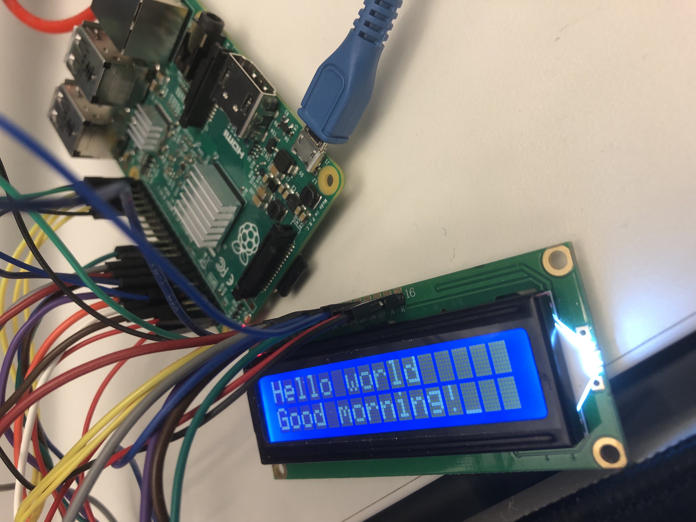

# RASP-LCD-16x2
LCD 16x2 on Raspberry Pi

### Goals?
- Firstly I got bored so I was trying to do sth for fun.
- I've been trying to use RPi as my dev/test/automation platform, and wiringPi seems to be easy to use
- This LCD just requires bitbanging, no particular protocols.

### Lessons learned
Not much, it's quite straightforward. The trickiest was the contrast pin.

### To compile
```csharp
gcc -Wall -o LCD162 LCD_16x2.c -lwiringPi
```

To run
```csharp
./LCD162
```


